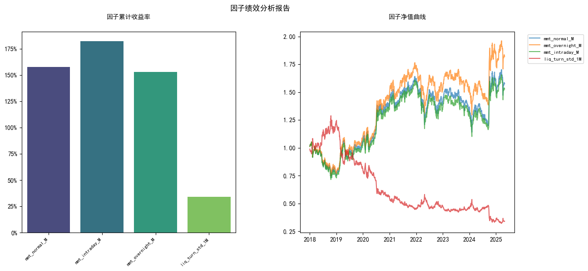

# Factor Mining for A Share （I）

MFE5210 Algorithm Trading 24/25

This will include:  
a. Code for generating alpha factors
b. Reference
c. Readme

- i. Correlation matrix (maximal correlation is 0.5)

- ii. Average sharp ratio for all alpha factors (without cost)

- iii. others  

## Data

Tushare: <https://tushare.pro/document/1?doc_id=131>

Token(5000 points):

```PlainText
2876ea85cb005fb5fa17c809a98174f2d5aae8b1f830110a5ead6211
```
see [get_date.ipynb](get_data.ipynb)

## Factor construction
see [cal_factor.ipynb](cal_factor.ipynb)

- mmt_intraday_M
   - 名称：1个月日内动量
   - 计算方式：过去一个月的日内涨跌幅之和
   - 逻辑：收益率中日内涨跌幅可能蕴含与日度收益率不同的信息特征，业界认为A股中日内收益率包含日度收益率中的“反转”成份。
- mmt_normal_M
   - 名称：1个月收益率
   - 计算方式：过去1个月收益率
   - 逻辑：最近一个月的收益率更多体现了散户投资者对于近期信息的过度反映。
- mmt_overnight_M
   - 名称：1个月隔夜动量
   - 计算方式：过去一个月的隔夜涨跌幅之和
   - 逻辑：收益率中隔夜涨跌幅可能蕴含与日度收益率不同的信息特征，业界认为A股中隔夜收益率包含日度收益率中的“动量”成份。
- liq_turn_std_1M
   - 名称：1个月换手率标准差
   - 计算方式：1个月换手率的标准差
   - 逻辑：表示中低频流动性，流动性越差的因子往往收益率更高。

## Factor processing
The factor processing includes winsorization, standardization, and neutralization with respect to industry and market value. However, due to the slow speed of regression calculations, the consideration of industry was abandoned in favor of solely conducting market value neutralization.

see [process.py](process.py)

## Factor correlation
|               | mmt_intraday_M | mmt_normal_M | mmt_overnight_M | liq_turn_std_1M |
|---------------|----------------|--------------|-----------------|-----------------|
| mmt_intraday_M| 1.000000       | 0.823706     | -0.322431       | 0.369388        |
| mmt_normal_M  | 0.823706       | 1.000000     | 0.214564        | 0.232878        |
| mmt_overnight_M| -0.322431      | 0.214564     | 1.000000        | -0.213000       |
| liq_turn_std_1M| 0.369388       | 0.232878     | -0.213000       | 1.000000        |

## Sharpe Ratio & cummulated return
|  | Sharpe   | Cumulative_Return |
|------|----------|-------------------|
| mmt_intraday_M    | 1.3513   | 1.576368          |
| mmt_normal_M    | 1.6561   | 1.821583          |
| mmt_overnight_M    | 0.7461   | 1.527560          |
| liq_turn_std_1M    | 	-0.6311   | 0.339818          |



## Reference
[Alphalens](https://github.com/quantopian/alphalens.git) [指南](https://zhuanlan.zhihu.com/p/256324663)

[中金-价量因子手册](references\中金-量化多因子手册\中金公司-量化多因子系列（7）：价量因子手册-56页.pdf)

[量价背离因子](https://bigquant.com/wiki/doc/Hn333yYkfS)

[全换手天数因子](https://www.joinquant.com/view/community/detail/71d8b77cbd1da76b659e04d2c7478c0c?type=1)

[下轨线（布林线）指标 boll_down](https://www.joinquant.com/view/factorlib/detail/94aec050cf469a9803395b8994f5e5ac?buildtype=0&universetype=eno1MDA%3D&period=M3k%3D&commisionFee=MA%3D%3D&skipPaused=MQ%3D%3D)