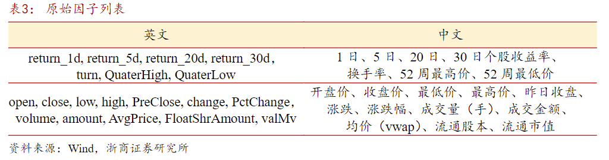

<<<<<<< HEAD
# Factor Mining for A Share （I）

## Data

Tushare: <https://tushare.pro/document/1?doc_id=131>

Token(5000 points):

```PlainText
2876ea85cb005fb5fa17c809a98174f2d5aae8b1f830110a5ead6211
```

## Reference

[Genetic Programming in factor mining](https://bigquant.com/wiki/pdfjs/web/viewer.html?file=/wiki/static/upload/52/529a958c-f60c-4ccd-a491-238c02e013d6.pdf)

本文对传统遗传规划的底层代码进行升级改造，使其在迭代中能处理多维面板数据和时序数据、纳入自定义算子、以及过拟合预防机制。通过在模型中引入早停机制（规避过拟合）、公式膨胀控制（避免无效运算）、热启动（避免早熟收敛）、父子竞争（保留优质父代）等不同方法来减少遗传因子挖掘模型中的过拟合情况，最终从遗传规划中大量的随机种群中出发。通过多代的进化和迭代，从而提升每代有效公式数、挖掘到多个适应度高、过拟合情况较少、有明确表达式的月度选股因子。

样本数据时间跨度为2018年1月至2021年12月，样本外区间（2022年和2023年10月）

在主流宽基中选股测试因子表现。复合因子。

### 遗传算法的介绍

其基本原理和操作步骤如下：
个体编码：将问题的潜在解决方案编码成树状结构，树的节点可能是加、减、乘、除等运算，终端则是输入变量和常量。
初始化种群：随机生成一组初始的树状个体，这些个体构成初始种群，代表问题的初始解集合。
适应度评估：定义适应度函数，用于衡量每个个体对问题的解决能力。根据个体在解决实际问题中的表现，计算其适应度值。

遗传操作：

- 选择：基于适应度值，采用轮盘赌选择、锦标赛选择等方法，从种群中选择较优的个体，使适应度高的个体有更大机会被选中，用于繁殖下一代。
- 交叉：对选择的个体进行交叉操作，随机选择两个个体（父代），交换它们的部分子树，生成新的个体（子代），从而引入新的解决方案。
- 变异：以一定概率对个体的节点进行变异，如改变节点的函数或终端值，维持种群的多样性，避免算法过早收敛。
迭代优化：不断重复适应度评估和遗传操作，产生新的种群，使种群中的个体逐渐适应环境，即适应度值不断提高。当满足预设的终止条件（如达到最大迭代次数、适应度值收敛等），算法停止。

结果输出：算法终止时，从最终种群中选择适应度最高的个体，经过解码，作为问题的近似最优解输出。

### 遗传算法模型因子挖掘框架

本文使用了python中gplearn库开展遗传规划的因子挖掘，该模块基于遗传规划并提供了因子挖掘基础的解决思路：随机生成大量特征组合，解决了没有先验知识。同时，通过遗传规划进行有监督的因子组合迭代，大量低相关和适应度的因子会在迭代中被淘汰，从而留下较优的因子。不过此方法普遍存在过拟合的风险，但其优势在于通过启发式的挖掘，构建出人工难以构造、复杂的因子。需重点关注的是gplearn不能同时处理多维面板（panel）和时序数据，因此不能直接运用于选股因子的挖掘。为解决这个问题，我们需对gplearn 的底层代码进行修改，使其在迭代时能同时处理截面数据并纳入对应的时序信息。

股票池：全A选股，剔除上市不满6个月及ST、*ST、PT、暂停上市等特别处理股票后的个股。
时间区间：2018/01/01至2021/12/31。
预测目标：个股20个交易日后收益率。此策略目的为挖掘月频因子，考察因子预测未来20天股票收益的表现。
原始数据：【表3】

注：表格第一行数据需要自己算，并且会导致因子值不从180101开始，能从哪开始就从哪里开始，190101开始也行。
数据清洗：对所获得的量化数据进行缺失值检测和填充（KNN），删除了有大量缺失值的样本；将数据转换到适合模型输入的格式，如浮点数和整数；对数据范围差异大的特征进行标准化统一量纲。


参数：
fitness: RankIC
population_size: 每一代的公式个数
init_depth: 公式树的初始化深度max和min （无法像决策树那样网格搜索调参）

方程定义合集
扩充gplearn的自定义函数集(function_set)【表2】
=======
# MFE5210
MFE5210 Algorithm Trading 24/25

This will include:  
a. Code for generating alpha factors   
b. Reference   
c. Readme   
i. Correlation matrix (maximal correlation is 0.5)   
ii. Average sharp ratio for all alpha factors (without 
cost)   
iii. others  
>>>>>>> 96adced54b1af160f4f380bc5f4842d8a1036a98
